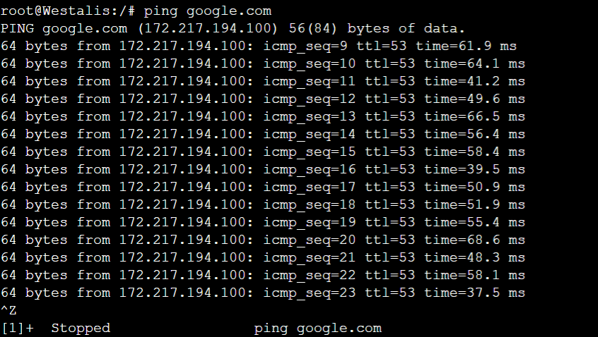

# Jarkom-Modul-5-ITB02-2022

Anggota kelompok:

1. Asima Prima Y. Tampubolon 5027201009
2. Cherylene Trevina 5027201033
3. Fatih Rian Hibatul Hakim 5027201066

## Daftar Isi

* [Topologi](#topologi)
* [Subnetting](#subnetting)
    * [Pembagian Subnet](#pembagian-subnet)
    * [Pohon subnet](#pohon-subnet)
    * [Tabel subnet](#tabel-subnet)
* [Konfigurasi](#konfigurasi-gns3)
    * [Masing-masing node](#masing-masing-node)
    * [DNS, Web Server, DHCP Relay, DHCP Server](#dns-web-server-dhcp-relay-dhcp-server)
    * [DHCP Relay](#konfigurasi-ostania--westalis---dhcp-relay)
    * [DHCP Server](#konfigurasi-wise---dhcp-server)
    * [DNS Server](#konfigurasi-eden---dns-server)
* [Routing](#routing)

Pengerjaan soal:

* [Soal 1](#soal-1) & [Jawaban](#jawaban-soal-1)
* [Soal 2](#soal-2) & [Jawaban](#jawaban-soal-2)
* [Soal 3](#soal-3) & [Jawaban](#jawaban-soal-3)
* [Soal 1](#soal-4) & [Jawaban](#jawaban-soal-4)

## Topologi

Pembuatan topologi dengan keterangan:

* Eden adalah DNS Server
* WISE adalah DHCP Server
* Garden dan SSS adalah Web Server
* Jumlah Host pada Forger adalah 62 host
* Jumlah Host pada Desmond adalah 700 host
* Jumlah Host pada Blackbell adalah 255 host
* Jumlah Host pada Briar adalah 200 host

Topologi yang telah dibuat:
<!-- Monggo kim -->


## Subnetting

### Pembagian Subnet


### Pohon Subnet


### Tabel Subnet


## Konfigurasi GNS3

### Masing-masing Node

#### [Strix]
`auto eth0
iface eth0 inet dhcp

auto eth1
iface eth1 inet static
	address 192.215.7.149
	netmask 255.255.255.252

auto eth2
iface eth2 inet static
	address 192.215.7.145
	netmask 255.255.255.252`

#### [Westalis]
`auto eth0
iface eth0 inet static
	address 192.215.7.129
	netmask 255.255.255.248
auto eth1
iface eth1 inet static
	address 192.215.7.1
	netmask 255.255.255.128
auto eth2
iface eth2 inet static
	address 192.215.0.1
	netmask 255.255.252.0
auto eth3
iface eth3 inet static
	address 192.215.7.146
	netmask 255.255.255.252`

#### [Ostania]
`auto eth0
iface eth0 inet static
	address 192.215.7.150
	netmask 255.255.255.252
auto eth1
iface eth1 inet static
	address 192.215.6.1
	netmask 255.255.255.0
auto eth2
iface eth2 inet static
	address  192.215.4.1
	netmask 255.255.254.0
auto eth3
iface eth3 inet static
	address  192.215.7.137
	netmask 255.255.255.148`

#### [Forger, Desmond, Briar, Blackbell]
`auto eth0
iface eth0 inet dhcp`

#### [Eden]
`auto eth0
iface eth0 inet static
	address 192.215.7.130
	netmask 255.255.255.248
        gateway 192.215.7.129`

#### [Wise]
`auto eth0
iface eth0 inet static
	address 192.215.7.131
	netmask 255.255.255.248
        gateway 192.215.7.129`

#### [Garden]
`auto eth0
iface eth0 inet static
	address 192.215.7.138
	netmask 255.255.255.248
        gateway 192.215.7.137`

#### [SSS]
`auto eth0
iface eth0 inet static
	address 192.215.7.139
	netmask 255.255.255.248
        gateway 192.215.7.137`


### DNS, Web Server, DHCP Relay, DHCP Server

`iptables -t nat -A POSTROUTING -o eth0 -j MASQUERADE -s 192.215.0.0/16

echo nameserver 192.168.122.1 > /etc/resolv.conf`


### Konfigurasi Ostania & Westalis - DHCP Relay

`apt update
apt install isc-dhcp-relay -y
echo 'SERVERS="192.215.7.131"INTERFACES="eth2 eth3 eth1 eth0"OPTIONS=""' > /etc/default/isc-dhcp-relay
service isc-dhcp-relay restart`


### Konfigurasi WISE - DHCP Server

`edit file  >/etc/default/isc-dhcp-server
apt update
apt install isc-dhcp-server -y
echo "INTERFACES=\"eth0\"" > /etc/default/isc-dhcp-server`

`Edit >File /etc/dhcp/dhcpd.conf
echo “
ddns-update-style none;
option domain-name "example.org";
option domain-name-servers ns1.example.org, ns2.example.org;
default-lease-time 600;
max-lease-time 7200;
log-facility local7;
subnet 192.215.0.0 netmask 255.255.252.0 {
    range 192.215.0.2 192.215.3.254;
    option routers 192.215.0.1;
    option broadcast-address 192.215.3.255;
    option domain-name-servers 192.215.7.130;
    default-lease-time 360;
    max-lease-time 7200;
}
subnet 192.215.7.0 netmask 255.255.255.128 {
    range 192.215.7.2 192.215.7.126;
    option routers 192.215.7.1;
    option broadcast-address 192.215.7.127;
    option domain-name-servers 192.215.7.130;
    default-lease-time 720;
    max-lease-time 7200;
}
subnet 192.215.4.0 netmask 255.255.254.0 {
    range 192.215.4.2 192.215.5.254;
    option routers 192.215.4.1;
    option broadcast-address 192.215.5.255;
    option domain-name-servers 192.215.7.130;
    default-lease-time 720;
    max-lease-time 7200;
}
subnet 192.215.6.0 netmask 255.255.255.0 {
    range 192.215.6.2 192.215.6.254;
    option routers 192.215.6.1;
    option broadcast-address 192.215.6.255;
    option domain-name-servers 192.215.7.130;
    default-lease-time 720;
    max-lease-time 7200;
}
subnet 192.215.7.128 netmask 255.255.255.248 {}
subnet 192.215.7.144 netmask 255.255.255.252 {}
subnet 192.215.7.148 netmask 255.255.255.252 {}
subnet 192.215.7.136 netmask 255.255.255.248 {}” >File /etc/dhcp/dhcpd.conf`

`service isc-dhcp-server restart`

### Konfigurasi Eden - DNS SERVER

`apt-get install bind9 -y

echo "
options {
        directory \"/var/cache/bind\";
        forwarders {
                192.168.122.1;
        };
        allow-query{any;};
        auth-nxdomain no;
        listen-on-v6 { any; };
};

" > /etc/bind/named.conf.options`

`service bind9 restart`

## Routing

## Soal 1

Agar topologi yang kalian buat dapat mengakses keluar, kalian diminta untuk mengkonfigurasi Strix menggunakan iptables, tetapi Loid tidak ingin menggunakan MASQUERADE.

## Jawaban Soal 1

Pada node Strix, masukkan command berikut:

```sh
IPETH0="$(ip -br a | grep eth0 | awk '{print $NF}' | cut -d'/' -f1)"

iptables -t nat -A POSTROUTING -o eth0 -j SNAT --to-source "$IPETH0" -s 192.215.0.0/21
```

Selanjutnya, dilakukan tes ping ke google dengan hasil sebagai berikut:



## Soal 2

Kalian diminta untuk melakukan drop semua TCP dan UDP dari luar Topologi kalian pada server yang merupakan DHCP Server demi menjaga keamanan.

## Jawaban Soal 2

Untuk menyelesaikan soal ini, pada node **Strix**, masukkan command:

```sh
iptables -A FORWARD -d 192.215.7.131 -i eth0 -p tcp --dport 80 -j DROP
```

## Soal 3

Loid meminta kalian untuk membatasi DHCP dan DNS Server hanya boleh menerima maksimal 2 koneksi ICMP secara bersamaan menggunakan iptables, selebihnya didrop.

## Jawaban Soal 3

Pada soal ini, masukkan command berikut pada **DHCP Server (WISE)** & **DNS Server (Eden)**

```sh
iptables -A INPUT -p icmp -m connlimit --connlimit-above 2 --connlimit-mask 0 -j DROP
```

Tes ping dari keempat node:


## Soal 4

Akses menuju Web Server hanya diperbolehkan disaat jam kerja yaitu Senin sampai Jumat pada pukul 07.00 - 16.00.

## Jawaban Soal 4

Untuk pembatasan akses pada jam tersebut, kami menggunakan command berikut untuk Web Server (Forger & Desmond):

Forger

```sh
iptables -A INPUT -s 192.215.7.0/25 -m time --timestart 07:00 --timestop 16:00 --weekdays Mon,Tue,Wed,Thu,Fri -j ACCEPT
iptables -A INPUT -s 192.215.7.0/25 -j REJECT
```

Desmond

```sh
iptables -A INPUT -s 192.215.0.0/22 -m time --timestart 07:00 --timestop 16:00 --weekdays Mon,Tue,Wed,Thu,Fri -j ACCEPT
iptables -A INPUT -s 192.215.0.0/22 -j REJECT

```

Selanjutnya, testingnya seperti berikut:

Cek tanggal dan jam sekarang


Tes ping


